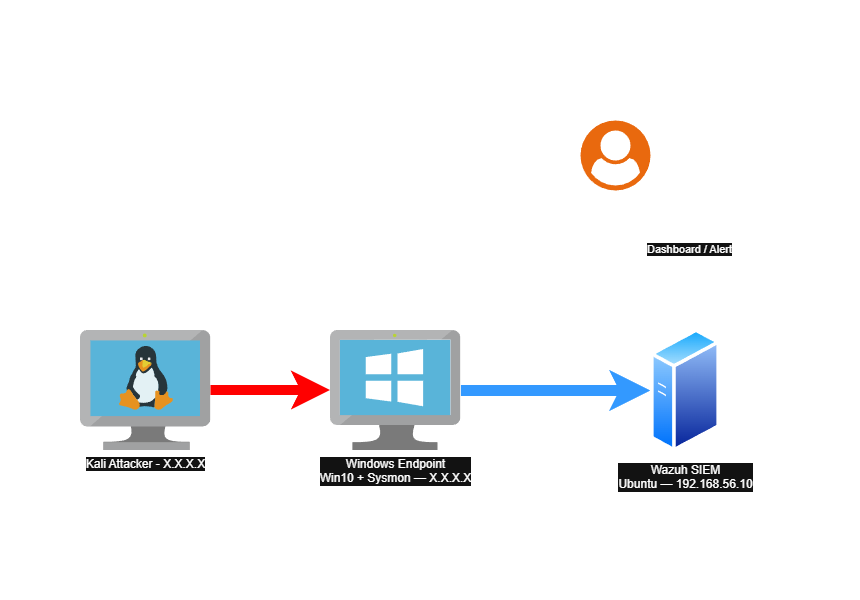

# SOC Home Lab


>A self-contained blue-team lab simulating the detection-to-triage workflow of a SOC, built with Wazuh, Sysmon, and Sigma.


---

## Overview


This project is a self-contained SOC home lab built to practice blue-team detection and incident triage in a safe and isolated environment. It simulates the core workflow of a Security Operation Center: an attacker machine generates malicious activity against a Windows endpoint, the telemetry is forwarded to a Wazuh SIEM, and each scenario is investigated. 


---

## Architecture




See [`docs/architecture.md`](./docs/architecture.md) for the full network design, machine specs, and data flow.

---

## Repository Structure

```
soc-home-lab/
├── docs/                 # architecture, setup guides
├── scenarios/            # attack -> detection -> triage, one folder each
├── detection-rules/      # Sigma rules (MITRE-mapped)
└── incident-reports/     # formal triage reports
```

---

## Scenarios


✅ done / 🚧 in progress / 📋 planned.


| #  | Scenario | MITRE Technique | Status |
|----|----------|-----------------|--------|
| 01 | [SQLi WebApp](./scenarios/01-web-sqli/README.md) | T1190  — Web Application SQL Injection | ✅ |
| 02 | [Credential dumping](./scenarios/02-credential-dumping/README.md) | T1003.001  — Credential dumping (Mimikatz) | ✅ |
| 03 | [Persistance](./scenarios/03-persistance/README.md) | T1053 / T1547  — Persistance - Scheduled Task or Registry Run Key | 📋 |
| 04 | [Discovery](./scenarios/04-discovery/README.md) | T1057, T1082  — Discovery / Recon | 📋 |

---

## Detection Rules

Custom Sigma detection rules live in [`detection-rules/`](./detection-rules/), each mapped to a MITRE ATT&CK technique.

---

## Tools & Technologies


- **SIEM:** Wazuh
- **Endpoint telemetry:** Sysmon (SwiftOnSecurity config)
- **Detection format:** Sigma
- **Attack simulation:** Atomic Red Team
- **Framework:** MITRE ATT&CK

---

## About


Built by Valerio Porcile — software developer transitioning into blue-team security.
[LinkedIn](https://www.linkedin.com/in/valerio-porcile/)