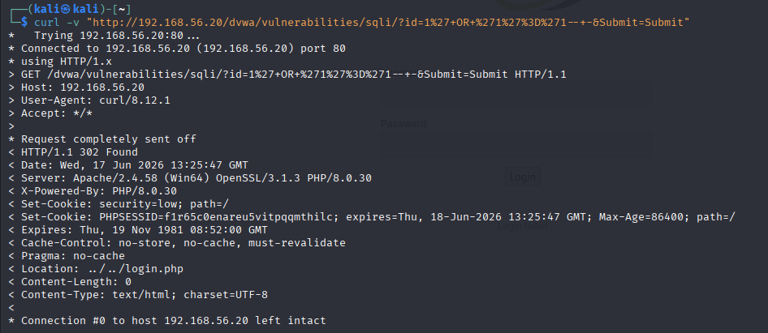
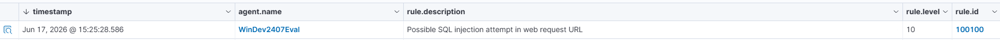

# Scenario 01 — Web Application SQL Injection

## Summary

SQL injection attack against DVWA hosted on the Windows endpoint, launched from the Kali attacker. The attack was not caught by Wazuh's default ruleset, so a custom detection rule was written to identify SQLi patterns in Apache access logs, mapped to MITRE T1190.

| Field            | Value |
|------------------|-------|
| MITRE Tactic     | Initial Access |
| MITRE Technique  | T1190 — Exploit Public-Facing Application |
| Target           | win-endpoint (192.168.56.20) — DVWA on XAMPP/Apache |
| Attacker         | kali-attacker (192.168.56.30) |
| Tools used       | browser , curl |
| Detection source | Apache access.log + custom Wazuh rule 100100 |

---


## 1. Attack


From Kali, SQLi request to the vulnerable page of DVWA:

```bash
curl "http://192.168.56.20/dvwa/vulnerabilities/sqli/?id=1%27+OR+%271%27%3D%271--+-&Submit=Submit"
```

Payload decoded: ' OR '1'='1-- -


---

## 2. Telemetry

Apache registers the request in C:\xampp\apache\logs\access.log:

```bash 
192.168.56.30 - - [...] "GET /dvwa/vulnerabilities/sqli/?id=1%27+OR+%271%27%3D%271--+-&Submit=Submit HTTP/1.1" 302 - "-" "curl/8.12.1"
```

Suspect indicators: SQL URL-encoded payload in the parameters (%27 = ', OR, --) and curl user-agent instead of a browser. Important: the normal request (status 200/302) doesn't trigger any  Wazuh rule by default.

---

## 3. Detection

Wazuh's default detection doesn't cover this SQLi. Custom rule added in local_rules.xml:

```xml
<rule id="100100" level="10">
  <if_sid>31100</if_sid>
  <url>%27|%22| OR | UNION | SELECT |--|%3D|1=1</url>
  <description>Possible SQL injection attempt in web request URL</description>
  <mitre><id>T1190</id></mitre>
</rule>
```

Searches for SQLi typical markers in the URL ( ' , keyword SQL, comments, 1=1).

---

## 4. Triage

Alert received: "Possible SQL injection attempt", level 10, on /dvwa/vulnerabilities/sqli/. Pivot: The source IP is 192.168.56.30; the user agent curl indicates an automated tool, not legitimate browsing; the payload in the parameters is an SQL tautology. Conclusion: True positive, SQL injection attempt. In a real-world scenario, I would check whether the request returned data (status/response size) to determine if the attack was successful, and I would look for other requests from the same IP to reconstruct the attack session.



---

## 5. Outcome

True positive, detection works. Limitation of the current rule: the pattern is broad (e.g., = or -- also appear in legitimate traffic) and will generate false positives. Improvement: Require the presence of a single quote + SQL keyword, or use Wazuh's more specific web rules as a base. Next step: test more evasive SQLi (double encoding, DVWA's security level medium).


