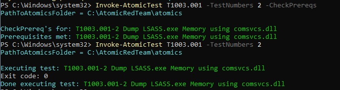
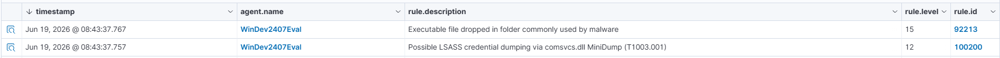

# Scenario 02 — LSASS Credential Dumping (comsvcs.dll)

## Summary

Credential dumping attack against the Windows endpoint, executed with Atomic Red Team (test T1003.001-2). The technique abuses the legitimate `comsvcs.dll` (a Windows LOLBin) to dump LSASS process memory, where credentials reside. Wazuh's default ruleset flagged side effects but did not identify the technique itself, so a custom detection rule was written to match the `comsvcs.dll` + `MiniDump` command-line signature, mapped to MITRE T1003.001.

| Field            | Value |
|------------------|-------|
| MITRE Tactic     | Credential Access |
| MITRE Technique  | T1003.001 — OS Credential Dumping: LSASS Memory |
| Target           | win-endpoint (192.168.56.20) |
| Attacker         | Local execution via Atomic Red Team |
| Tools used       | Atomic Red Team, rundll32.exe, comsvcs.dll |
| Detection source | Sysmon Event ID 1 (process creation) + custom Wazuh rule 100200 |

---

## 1. Attack

Executed on the endpoint with Atomic Red Team (Windows Defender real-time protection
disabled in the isolated VM, clean-state snapshot taken beforehand):

```powershell
Invoke-AtomicTest T1003.001 -TestNumbers 2
```

The test runs the following command, which dumps LSASS memory to a `.dmp` file:

```
rundll32.exe C:\windows\System32\comsvcs.dll, MiniDump (Get-Process lsass).id $env:TEMP\lsass-comsvcs.dmp full
```



---

## 2. Telemetry

Sysmon records the process creation (Event ID 1). Captured command line:

```
"powershell.exe" & {C:\Windows\System32\rundll32.exe C:\windows\System32\comsvcs.dll, MiniDump (Get-Process lsass).id $env:TEMP\lsass-comsvcs.dmp full}
```

Suspect indicators: the legitimate `rundll32.exe` loading `comsvcs.dll` with the
`MiniDump` export, targeting the PID of `lsass.exe`, and writing a `.dmp` file to
a temp folder. Integrity level was `High` (elevated execution).

Important finding: the SwiftOnSecurity Sysmon config does NOT log Event ID 10
(ProcessAccess), so the direct LSASS access was not visible. Detection was instead
built on the process-creation command line (Event ID 1).

---

## 3. Detection

Wazuh's default ruleset only flagged side effects ("PowerShell spawned PowerShell",
"Executable dropped in folder commonly used by malware"), not the technique itself.
Custom rule added in `local_rules.xml`:

```xml
<rule id="100200" level="12">
  <if_sid>92027</if_sid>
  <field name="win.eventdata.commandLine" type="pcre2">(?i)comsvcs\.dll.{0,20}MiniDump</field>
  <description>Possible LSASS credential dumping via comsvcs.dll MiniDump (T1003.001)</description>
  <mitre><id>T1003.001</id></mitre>
</rule>
```

Logic: builds on the Sysmon process-creation rule (`if_sid 92027`) and matches the
`comsvcs.dll` + `MiniDump` pair in the command line. The combination is a strong
signature — `comsvcs.dll` alone is legitimate, but together with `MiniDump` it is
almost always a memory-dumping attack.

---

## 4. Triage

Alert received: "Possible LSASS credential dumping via comsvcs.dll MiniDump", level 12,
rule 100200. It appeared alongside the native Wazuh alert 92213 ("Executable file
dropped...", level 15), showing how a single attack generates multiple correlated
alerts. Pivot: the command line confirms `rundll32` loading `comsvcs.dll` with
`MiniDump` against the LSASS PID, writing `lsass-comsvcs.dmp` to the temp folder;
integrity level High confirms elevated execution. Conclusion: true positive, LSASS
credential dumping attempt. In a real environment I would check whether the `.dmp`
file was exfiltrated, look for follow-on use of the dumped credentials (lateral
movement, new logons), and isolate the host.



---

## 5. Outcome

True positive, detection works and precisely identifies the technique.
Limitation: the rule depends on the command line being visible (Event ID 1); an
attacker calling the MiniDump API directly (without the comsvcs command line) would
evade it. Improvement / next step: enable Sysmon Event ID 10 (ProcessAccess) filtered
on `TargetImage` ending in `lsass.exe`, to detect LSASS access regardless of the tool
used — a more robust, technique-agnostic detection.

---

## References

- MITRE ATT&CK T1003.001: https://attack.mitre.org/techniques/T1003/001/
- Atomic Red Team T1003.001: https://github.com/redcanaryco/atomic-red-team/blob/master/atomics/T1003.001/T1003.001.md