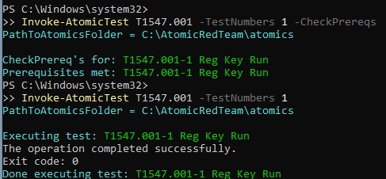
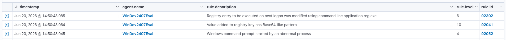
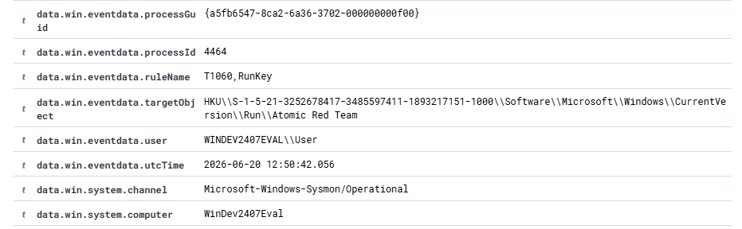

# Scenario 03 — Registry Run Key Persistence

## Summary

Persistence attack against the Windows endpoint, executed with Atomic Red Team
(test T1547.001-1). The technique writes a value to the `...\CurrentVersion\Run`
registry key so that a program launches automatically at user logon. Unlike the
previous scenarios, Wazuh's built-in ruleset detected this technique natively;
this scenario therefore focuses on triaging and validating existing detections
rather than writing a new rule, mapped to MITRE T1547.001.

| Field            | Value |
|------------------|-------|
| MITRE Tactic     | Persistence |
| MITRE Technique  | T1547.001 — Registry Run Keys / Startup Folder |
| Target           | win-endpoint (192.168.56.20) |
| Attacker         | Local execution via Atomic Red Team |
| Tools used       | Atomic Red Team, reg.exe |
| Detection source | Sysmon Event ID 13 (RegistryValueSet) — native Wazuh rules 92302, 92041 |

---

## 1. Attack

Executed on the endpoint with Atomic Red Team:

```powershell
Invoke-AtomicTest T1547.001 -TestNumbers 1
```

The test uses `reg.exe` to add a value to the user's Run key, pointing to an
executable that would run at every logon:

```
reg add HKCU\Software\Microsoft\Windows\CurrentVersion\Run /v "Atomic Red Team" /d "C:\Path\AtomicRedTeam.exe"
```



---

## 2. Telemetry

Sysmon recorded the registry modification (Event ID 13, RegistryValueSet).
Key fields from the event:

```
EventID:       13 (RegistryValueSet)
Image:         C:\Windows\system32\reg.exe
TargetObject:  HKU\...\Software\Microsoft\Windows\CurrentVersion\Run\Atomic Red Team
Details:       C:\Path\AtomicRedTeam.exe
User:          WINDEV2407EVAL\User
RuleName:      T1060,RunKey   (Sysmon config tags the MITRE technique)
```

Suspect indicators: a value written to a well-known autorun location
(`CurrentVersion\Run`) via `reg.exe`, pointing to an executable that will run at
each logon. The SwiftOnSecurity Sysmon config logs Event ID 13 for known
persistence keys, so this telemetry reached the SIEM without additional tuning.

---

## 3. Detection

This technique was detected by Wazuh's native ruleset — no custom rule required.
Two correlated alerts fired:

- **Rule 92302** (level 6) — "Registry entry to be executed on next logon was
  modified using command line application reg.exe". Directly flags Run key
  persistence created via reg.exe.
- **Rule 92041** (level 10) — "Value added to registry key has Base64-like
  pattern". Flags that the written value resembles encoded/obfuscated content.

Together they describe the technique and hint at obfuscation, mapped to T1547.001.

---

## 4. Triage

Two alerts were raised within the same second on the endpoint. Pivoting on the
Sysmon event details confirmed the picture: `reg.exe` (PID 4464, run as
WINDEV2407EVAL\User) set a value named "Atomic Red Team" under
`HKCU\...\CurrentVersion\Run`, pointing to `C:\Path\AtomicRedTeam.exe`. The
combination of (a) a write to a known autorun key and (b) a Base64-like value is a
strong persistence signal. Conclusion: true positive, Run key persistence. In a real
environment I would identify the referenced executable, determine how it was placed
on disk, correlate with any preceding access/credential activity, and remove the
autorun entry as containment. This scenario also shows how an analyst validates and
correlates native SIEM detections rather than writing new rules for every case.





---

## 5. Outcome

True positive, detected by native Wazuh rules. No custom rule was needed — the value
of this scenario is the triage and correlation of existing detections, which is a
large part of real SOC L1 work. Next step / possible enrichment: a custom rule that
correlates "reg.exe modifying a Run key" with "Base64-like value" into a single
higher-severity alert, reducing the analyst's effort to connect the two signals; and
extending coverage to HKLM Run keys and Startup folder variants (other T1547.001 tests).

---

## References

- MITRE ATT&CK T1547.001: https://attack.mitre.org/techniques/T1547/001/
- Atomic Red Team T1547.001: https://github.com/redcanaryco/atomic-red-team/blob/master/atomics/T1547.001/T1547.001.md